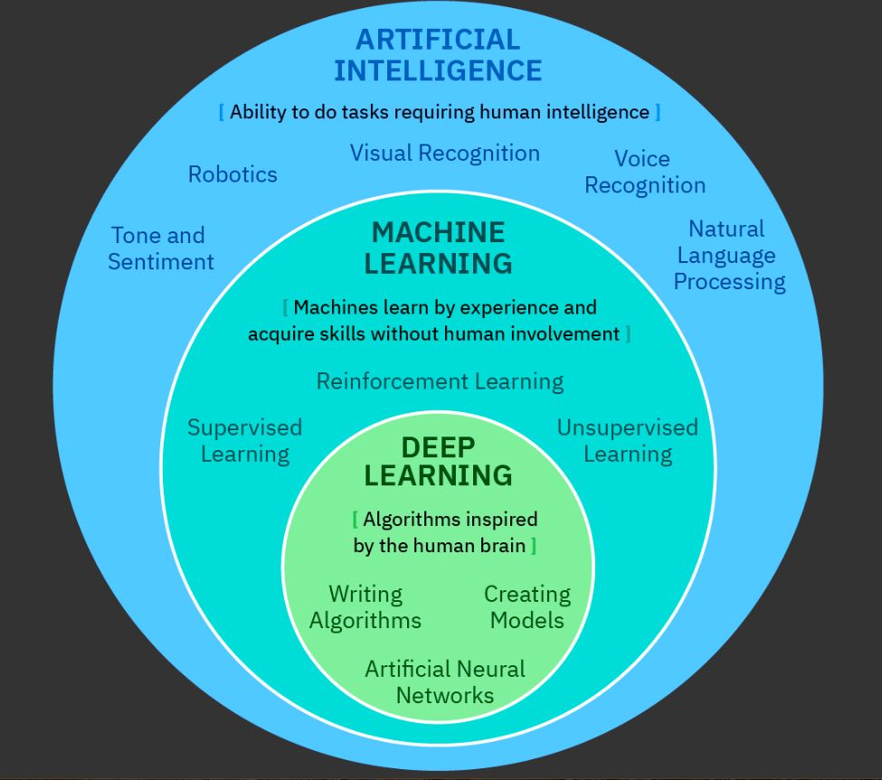

# artificialIntelligence

## Computers Help Humans: AI goes to work

### Human intelligence versus artificial intelligence
To have a conversation about artificial intelligence (AI), we need a practical definition of human intelligence (HI). Let’s consider that human intelligence is the ability to reason, solve problems, and learn. These activities involve a complex interaction between cognitive functions like perception, memory, language, and planning.

People do these things naturally because human intelligence enables us to learn from past experience, adapt to new situations, and handle abstract ideas. Humans can use learned knowledge to adapt to, shape, and change their environment.

### Types of AI
AI can process data and make certain kinds of predictions faster and more accurately than humans. But it isn’t magic and it isn’t all-powerful.

Let’s look at different levels of AI and what they can accomplish.

Weak AI
- Many companies use weak AI to automate tasks to get results quickly and at lower costs. Weak AI outperforms humans in narrowly defined tasks. Think of a chatbot that answers customer service questions, facial recognition on Facebook, buying recommendations on Amazon, or apps that can convert voice to text. Alexa, Google Assistant, and Siri all demonstrate weak AI.

Augmented Intelligence
- Augmented intelligence supplements human intelligence, helping humans make better decisions. It doesn’t replace humans. Instead, it boosts their expertise and improves their productivity. IBM Watson for Oncology, for example, helps health professionals identify key information in a cancer patient’s medical records, and it recommends several possible treatments along with estimates of how each one might work. Its recommendations are excellent, based on constantly updated research in cancer science. But it doesn’t choose the patient’s treatment. That’s up to the health professional. In other words, augmented intelligence helps humans become faster and smarter at the tasks they’re performing.

General AI
- General AI doesn’t exist yet. But when it does, it will be a form of “whole brain emulation,” where a machine can think and make decisions on many different subjects. It will drive the computers you see on science-fiction video, talking to humans about many subjects, while operating entire cities or starships. Today, general AI is a goal rather than a practical technology. It will require decades of additional research and more powerful computers to achieve.

### Artificial Intelligence | Machine Learning | Deep Learning

Artificial Intelligence
- Artificial intelligence describes machines that exercise capabilities usually associated with human intelligence. Current research in AI focuses on learning, reasoning, problem solving, perceiving, and understanding human language.

Machine Learning
- Machine learning, or ML, uses algorithms to learn from data. Given an input of data, ML can perform statistical analysis to determine an output. As with every kind of computing, the more data the machine is given (assuming that this data is valid), the more accurate is its output. ML uses human-like capabilities such as analysis, self-training, observation, and experience to learn without being explicitly programmed!

- ML comes in three flavors: supervised learning, unsupervised learning, and reinforcement learning. ML relies on these three types of algorithms. The application of any one of these algorithms depends on the relation to available data you are processing, the output that you need from your model, or maybe even the possibility of retro-feeding data to improve the algorithm. If it sounds complicated, it is.

- One amazing aspect of machine learning is its ability to modify itself when exposed to more data. It’s dynamic and doesn’t require human intervention to make changes! So as it’s exposed to more data, it continues to learn and improve its results.

- Machine learning is what prompted the bank to contact you about what might be someone using stolen information from your credit card. But it’s not perfect. Machine learning is also what threw off your Netflix recommendations after someone in your family watched a weird comedy on your account.

Deep Learning
- Deep learning, or DL, is a subcategory of machine learning that focuses on statistical models when it solves problems. It uses an artificial neural network, made of algorithms inspired by the human brain, as it solves complex problems by performing tasks over and over again many thousand times, each time tweaking it a little to improve the outcome. DL requires big data and enormous computing power, but has tremendous potential as we move toward the goal of general AI.

- Imagine the complexity of decisions to perform classification tasks directly from images, text, or sound with accuracy that might exceed human performance. How about driverless cars?

- Deep learning is a key technology behind driverless cars, enabling the computer to recognize a stop sign or to distinguish a pedestrian from a street light.

### Other technologies help AI
AI will create new opportunities for society, business, and for consumers. But for AI to be more widely adopted, other enabling technologies need to mature alongside it.

Cloud, for example, is already helping businesses access and share computing power they wouldn’t normally be able to afford. This shared technology, in turn, will enable those businesses to operate new training algorithms and data management required by AI.

Other emerging technologies will also be vital to AI’s growth. Visual recognition, natural language processing, predictive analytics, and even the Internet of Things (IoT) will empower AI, leading to new applications in medical devices, security, customer service, and more!

### Careers in Artificial Intelligence
By 2025, work done by machines will jump from 29% to more than 50%.

Experts required for the jump:
- AI interaction design
- Intelligence design
- Machine learning science
- Robotic analytics
- Digital knowledge management
- Data curation

Tech companies expanding in AI applications:
- Amazon
- Apple
- Cisco
- Facebook
- Google
- IBM
- Intel
- Microsoft
- Netflix
- SAP

Machine Learning engineers earned the most, averaging over $142,000 USD. (2019)

Skills to help getting into AI roles.
- Enter AI competitions like battlebots, kaggles, or hackathons
- Create a chatbot
- Learn GitHub and Kaggle
- Share code examples
- Read AI Blogs
- Applied Math
- Problem solving
- Data analysis
- Algorithm structure
- Probability and statistics
- Programming languages such as Python, C++, R, or Java

### Common Terms
Algorithms
- Algorithms are mathematical instructions written by data scientists that tell the machine how to go about finding solutions to a problem. When a small selection of data (called training data) is run through an algorithm repeatedly, each time tweaked by a data scientist until its results are reliably accurate, the result is a model that the machine can use for additional learning by itself.

Chatbot
- A chatbot is a computer program designed to simulate conversation with human users, especially over the internet. It is an assistant that communicates with us through text messages or voice and integrates as a virtual companion into websites, applications, or instant messengers.

Data
- Data fuels AI. It allows AI systems to reveal patterns, trends, and associations with confidence. Some data is structured, which means it’s been organized into a format that computers can easily read and analyze, such as a database or an Excel file. Other data is unstructured, like tweets, PDFs, and video files.

Deep learning
- Deep learning (DL) is a group of neural networks (which are, in turn, groups of machine learning models). Deep learning can find patterns in complex data structures like images, video, and sound. Many of its models need no explicit training to find a solution, making them excellent for solving problems too big and complex for humans to engineer. Deep learning has been used to train self-driving vehicles, detect fraud, and even make “Deepfake” videos of popular celebrities.

Machine learning
- Machine learning (ML) is the engine of an AI system. It describes machines that learn without explicit instructions on how to perform tasks. It often depends on models: trained artifacts that guide machines when interpreting new data. Models represent patterns of data and help a machine learning system make predictions without being told how to do so.

Natural language processing
- Natural language processing (NLP) is the ability of a computer program to understand human language as it is spoken. NLP can train computers to process large amounts of human text, like newspapers or conversations, comprehending the intent and meaning of that data. With NLP, a machine can then reply to humans with nuance and understanding. A common example of NLP is a customer service chatbot.

Neural networks
- Neural networks are groups of machine learning models. They simulate the human brain’s densely interconnected brain cells. They can learn things, recognize patterns, and make decisions without having to be explicitly programmed. Neural networks are capable of finding patterns within data that’s so complex that no human could program its analysis.

Reinforcement learning
- Reinforcement learning is a type of machine learning model that doesn’t give the machine any data at all, labeled or unlabeled. Instead, the machine tries different actions and receives reward signals (like cookies for a dog!) when it makes correct moves. In this way the system is trained solve a problem, with no human work required.

Speech recognition
- Speech recognition is technology that can recognize spoken words, which can then be converted to text or carry out a spoken command. A subset of speech recognition is voice recognition, which is the technology for identifying a person based on their voice.

Supervised learning
- Supervised learning is a type of machine learning model that provides the machine with a set of highly accurate data that’s been labeled by a human. The machine uses this model to recognize related things in untrained data sets.

Unsupervised learning
- Unsupervised learning is a type of machine learning model that doesn’t give the AI any labeled data. Instead it gives the AI unlabeled data, and the AI suggests various ways to cluster and organize it. This is valuable when the data is so large or complex that humans can’t identify its patterns themselves.

Visual recognition
- Visual recognition, also known as computer vision, is an AI subfield focused on training computers to understand and interpret pictures and video. Visual recognition models learn how to identify objects, people, or individual attributes in an image. For example, a model could help evaluate automobile accidents, identify the type of vehicle involved and its damage, and then estimate its cost to repair.

## Artificial Intelligence in Practice

### AI can communicate: Speaking naturally
AI understands human language
- In any language, there can be hundreds of ways to express a simple idea. Our brains have known since childhood how to process sentences and make sense of them. But computers can’t do that using traditional programming methods. It’s impossible for a programmer to cook up the exact wording for every possible sentence someone might say to a computer! Instead, AI scientists have helped computers understand language using a branch of computer science called natural language processing, or NLP.

- NLP powers chatbots, the computerized systems that provide basic customer service. You type or speak a question using a simple, ordinary sentence. The chatbot usually understands your question and responds accordingly.

- You’ll find an advanced application of NLP in the virtual assistants provided by smart phones and personal computing devices. Amazon’s Alexa, Microsoft’s Cortana, and Apple’s Siri can understand more complex questions.

- As NLP grows more sophisticated, you’ll interact with advanced virtual assistants like the fictional one demonstrated in this video.

### AI can help you do things: Driving and buying
AI can perform difficult tasks on your behalf
- AI can perform complex work once thought to be possible only for humans. Consider self-driving cars. Using cameras, radar, lidar, and GPS, they receive all sorts of inputs—road surface, speed limit, lane lines, traffic, pedestrians, light conditions, road signs, and more, all changing at highway speed! Their AI swiftly integrates these inputs and makes decisions to safely and accurately navigate the road.

AI can help you discover things
- AI can also automate searches, marketing, and advertising. By automatically analyzing data about your behavior and preferences, AI can make predictions or recommendations that are specific to you, or that reflect people similar to you.

- Amazon, for example, remembers books you’ve bought and suggests others that might also please you. LinkedIn recommends jobs that suit your profile. Netflix recommends programs similar to those you have already enjoyed. Right now, these recommendations have mixed value. If you buy socks on Amazon, it will recommend more socks to you whether you need them or not. But this kind of AI is advancing rapidly in its ability to personalize what it offers you.

- Another great example, one that isn’t about sales but about helping people, is IBM Watson for Oncology. It reads every word and test result for an individual cancer patient. At the same time, it stays abreast of more cancer research publications than could possibly be read by a human. Combining what it has learned about the patient with what it has learned from research, it makes treatment recommendations tailored precisely to the patient.

### AI can solve problems: Saving lives
AI can help humanity
- In the flood-prone region of Patna in northern India, the waters were rising. But thanks in part to an artificial intelligence system, residents of the region received early warnings on their phones. A flood forecasting system that Google developed for India’s Central Water Commission is making a difference! But it can do more than forecast high waters. It’s also smart enough to avoid false alarms.

- Sella Nevo, the head of the flood forecasting unit and a software engineering manager at Google, notes that “For our high-risk alerts, we had less than 10 percent false positives [down to regions measuring 64 by 64 metres] ... That’s highly accurate.” The trick is training the system’s accuracy so that unnecessary evacuations are avoided and trust can be built for the alert system.

But good solutions require good data
- If you or your friends enjoy computer programming, you’ve probably heard the acronym GIGO. It means “garbage in, garbage out.” When you work with bad data you’ll get bad results.

- GIGO also applies to AI. The most brilliant system can’t solve problems without high-quality data. It’s not enough to design the system well. You must also give it the ability to spot false information and to clean information that contains errors.

### AI can play games: Not just for fun!
Gaming applications for AI
- Some of the most famous applications of artificial intelligence have emerged from the world of games. Let’s find out how.

- It begins with programs designed to win difficult games. For years, the world’s greatest chess masters have tested their skills against computer opponents: from IBM’s Deep Blue to the current champion computer, Stockfish 9. This kind of advanced but narrow AI can’t pilot a self-driving car, carry on a conversation, or provide accurate flood warnings, but it’s undefeated against the world’s greatest human chess players.

- You’ve already read how natural language processing helped IBM Watson win the Jeopardy! championship (along with a huge set of data culled from Wikipedia and other sources).

- Some folks think that gaming is a fun but trivial way to use AI. We heard this, for example, when IBM’s Jeopardy! win was first aired. But lessons learned from that adventure helped IBM tackle enormous problems like global transportation and cancer treatment. Game systems provide complicated, fast-moving challenges whose solutions lead us to important new AI applications.

### AI can extend human expertise: Making us smarter
Intelligence augmentation
- There’s another way to look at artificial intelligence: instead of making decisions for us, we can design it to help us make better decisions. We call this intelligence augmentation. It refers to the development of computerized tools that complement human thinking.
